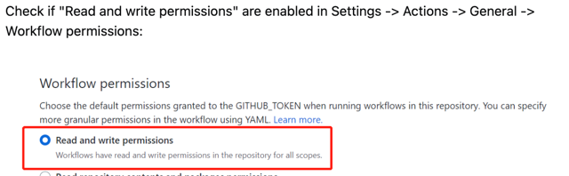

# github-action-allure-report-pages

1. GitHub Actions have to enable.

2. Provide Read/Write access 

3. Pages: "Settings" -->> "Code and automation" -->> "GitHub Pages".
In the "GitHub Pages" settings, look for the "Source" option and select "Deploy from a branch" from the dropdown menu.
Then, under the "Branch" dropdown, choose the branch  gh-pages then "Save".

4. Run the Workflow

5. Navigate to Pages https://vshkodin.com/github-action-allure-report-pages
